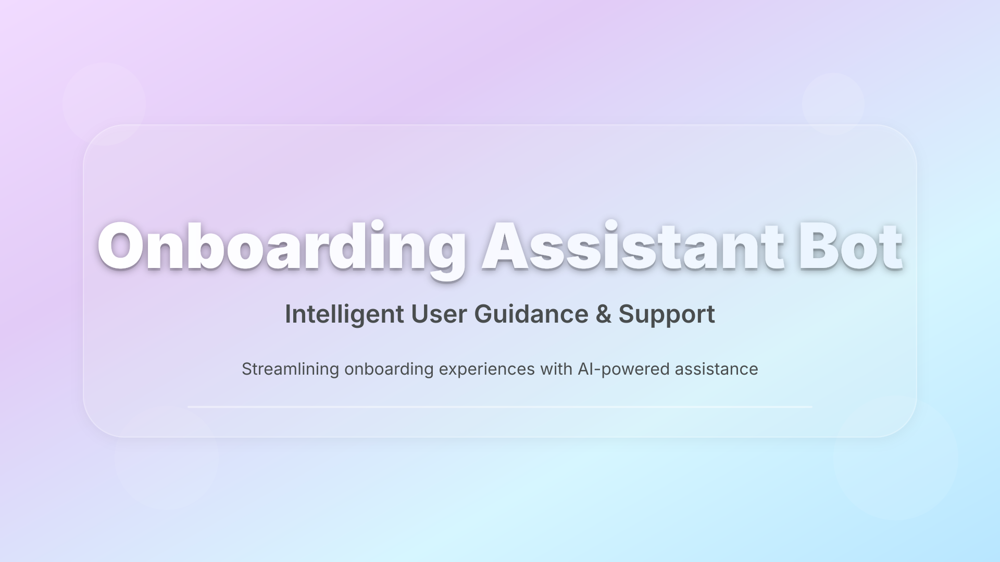
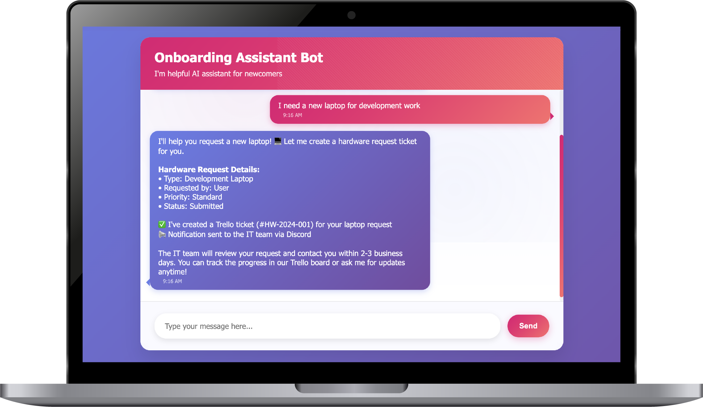

<p align="center">
  
  
  
  
  
</p>

<a id="-agents"></a>
<p align="center">
  
</p>

## Table of Contents

- [🏗️ Architecture](#️-architecture)
- [🤖 Agents](#-agents)
- [📊 Data Sources](#-data-sources)
- [⚙️ Setup & Configuration](#️-setup--configuration)
- [💡 Usage Examples](#-usage-examples)
- [🔧 Troubleshooting](#-troubleshooting)
- [🤝 Contributing & License](#-contributing--license)

**Onboarding Assistant Bot** — an AI-powered employee support system (built with n8n) that helps newcomers and existing employees with onboarding, HR resources, tech support, team info, and abbreviation explanations.

<p align="center">
    
</p>

<a id="️-architecture"></a>
<p align="center">
  
</p>

**Router Agent pattern** routes each message to specialized agents based on intent.

```text
Webhook Input → Router Agent → Switch → Specialized Agents → Response
```

- Router Agent: analyzes requests; actions → ONBOARDING, RESOURCES, TECH_SUPPORT, ABBREVIATION, CHAT
- Memory: buffer window memory with session management

  [↑ Back to Table of Contents](#table-of-contents)

---

<a id="-agents"></a>
<p align="center">
  
</p>

### Team Agent (ONBOARDING)

- Purpose: team members, project structure, onboarding processes
- Model: Azure OpenAI (o3-mini)
- Tools: team_members (vector), onboarding_checklist, tool_github_request

### HR Agent (RESOURCES)

- Purpose: HR queries and company info
- Model: Azure OpenAI (o3-mini)
- Tools: HR vector store
- Integration: Trello tickets

### Technical Support

- **UserMGMT_Agent (Access)**: role-based access, Discord + Trello
- **Technical_MGMT_Agent (Hardware)**: equipment management, Discord + Trello

### Abbreviation Agent

- Purpose: decodes company/technical acronyms
- Tools: abbreviation vector store

[↑ Back to Table of Contents](#table-of-contents)

---

<a id="-data-sources"></a>
<p align="center">
  
</p>

- Vector stores: Team members, Onboarding checklist, Company info, Access requirements, Hardware requirements,
  Abbreviations
- External integrations: GitHub (live repo data), Trello (tickets), Discord (notifications), HuggingFace (embeddings)

[↑ Back to Table of Contents](#table-of-contents)

---

<a id="️-setup--configuration"></a>
<p align="center">
  
</p>

> **Security first**: never commit real API keys or webhook URLs. Use an `.env` file and reference variables in n8n
> credentials.

**Prerequisites**

- Self-hosted n8n (or Cloud)
- API credentials: Google Gemini, Azure OpenAI, HuggingFace, Trello, Discord webhook

**Quick Start**

```bash
# 1) Import the JSON workflow to n8n
# 2) Create credentials in n8n using environment variables
# 3) Configure webhook with required header: x-session-id
```

**Environment (.env example)**

```ini
GEMINI_API_KEY=...
AZURE_OPENAI_KEY=...
HF_API_KEY=...
TRELLO_KEY=...
DISCORD_WEBHOOK_URL=...
WEBHOOK_ID=...
```

[↑ Back to Table of Contents](#table-of-contents)

---

<p align="center">
  
</p>

**Team Info**

```text
User: "Who owns Spring AI?"
Bot → Team Agent → "Alex Leeson — contact: ..."
```

**Hardware Request**

```text
User: "I need a new laptop"
Bot → Technical_MGMT_Agent → Trello ticket + Discord notification
```

**Access Request**

```text
User: "Please add me to GitLab"
Bot → UserMGMT_Agent → Trello ticket + Discord notification
```

**Abbreviation**

```text
User: "What does API mean?"
Bot → Abbreviation Agent → definition with examples
```

[↑ Back to Table of Contents](#table-of-contents)

---

<p align="center">
  
</p>

- Missing credentials → verify .env + n8n credentials
- Vector store errors → check HuggingFace limits
- Webhook failures → validate URL, method (POST), and payload shape
- Session issues → ensure `x-session-id` is present

[↑ Back to Table of Contents](#table-of-contents)

